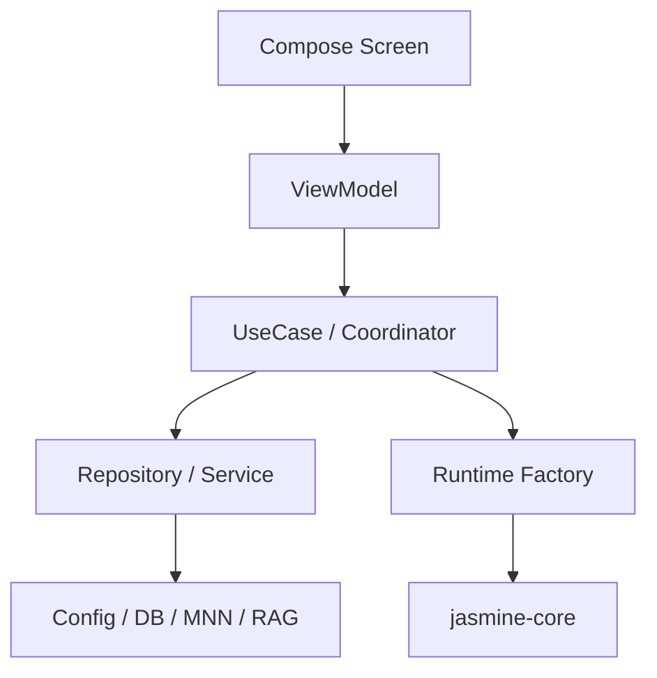

# 应用层重构实施计划

## 文档说明

- 本文档聚焦 **`app` 模块的应用层重构实施**。
- 目标是给出**可直接执行的落地计划**，而不是只给原则。
- 实施原则：**不停功能、不大爆炸、按阶段推进、每一步可回退**。

## 一、重构目标

本次应用层重构，不是为了把项目改成某个“看起来更高级”的纯架构，而是为了解决当前最真实的工程问题：

1. 页面层架构风格不统一。
2. `ChatViewModel` 过重。
3. 设置页直接访问全局配置服务过多。
4. 导航已迁移到 Compose 主线，但旧 Activity 残留未清。
5. 应用层编排边界不够清晰，后续功能叠加成本会继续上升。

因此本计划的目标是：

> **把 app 层逐步收口为“Compose Screen → ViewModel → UseCase/Coordinator → Repository/Service”的稳定结构。**

## 二、重构边界

### 本计划主要涉及

- `app/src/main/java/com/lhzkml/jasmine/...`
- `app/src/main/java/com/lhzkml/jasmine/ui/...`
- `app/src/main/java/com/lhzkml/jasmine/ui/navigation/...`
- `app/src/main/java/com/lhzkml/jasmine/config/...`
- `app/src/main/java/com/lhzkml/jasmine/mnn/...`（只在 app 层编排边界涉及）

### 本计划暂不主动大改

- `jasmine-core` 模块边界
- MNN JNI / C++ 具体推理逻辑
- 数据库存储结构
- MCP / RAG / Agent 底层算法与协议细节

也就是说，这是一份：

> **应用层收口计划，不是全仓库推翻式重构计划。**

## 三、目标结构



### 目标分工

#### 1. Screen
- 只负责显示与交互
- 不直接读取 `ProviderManager`
- 不直接访问 `ConversationRepository`
- 不直接组装运行时对象

#### 2. ViewModel
- 负责 UI State / UI Event
- 驱动页面刷新
- 调用 UseCase / Coordinator
- 不承接过多系统装配职责

#### 3. UseCase / Coordinator
- 负责业务流程
- 负责参数校验与流程调度
- 负责选择调用哪个 service/runtime

#### 4. Repository / Service
- 负责数据读写、配置、模型服务、RAG 访问等

#### 5. Runtime Factory
- 负责拼装 trace / event / persistence / tools / context 等运行时能力

## 四、实施原则

### 原则 1：先统一入口，再拆内部

导航如果不统一，后面的页面与 ViewModel 重构会一直被两套路由拖累。

### 原则 2：先改外围，再动主链

设置页和导航优先；聊天主链最后再收口。

### 原则 3：优先提炼中间层，不要把逻辑从一个大类搬到另一个大类

比如不要把 `ChatExecutor` 的逻辑全塞回 `ChatViewModel`。

### 原则 4：每一步都要保持可运行

一次只重构一块功能域，每一步都能验证 UI 和基础路径。

## 五、分阶段实施计划

## 阶段 0：建立基线（建议先做）

### 目标

在开始重构前明确当前稳定入口、关键页面和最低回归路径。

### 建议动作

1. 列出关键路径：
   - 启动应用
   - 普通聊天
   - 进入设置
   - 修改 provider
   - 切换模型
   - 进入 Agent 模式
2. 确认哪些页面当前主线已由 `AppNavigation` 承载。
3. 记录仍残留 `startActivity(...)` 的页面。

### 涉及文件

- `LauncherActivity.kt`
- `MainActivity.kt`
- `ui/navigation/AppNavigation.kt`
- `ui/ChatScreen.kt`
- `SettingsActivity.kt`

### 产出

- 一份当前主路径清单
- 一份残留旧入口清单

## 阶段 1：统一导航入口

### 目标

把主流程统一到：

> `LauncherActivity -> MainActivity -> AppNavigation`

### 需要解决的问题

- `ChatScreen` 中仍残留旧 Activity 跳转
- 旧设置页 Activity 与 Compose Nav 页面并存
- Manifest 与代码中历史入口不完全一致

### 建议动作

#### 1. 替换主链中的旧跳转

优先把以下逻辑改成 route 导航：

- `ChatScreen` → 设置页
- `ChatScreen` → Provider 配置页

#### 2. 明确“保留 Activity”与“转路由页面”边界

建议保留为 Activity 的只有：

- `LauncherActivity`
- `MainActivity`
- 真正需要外部系统入口的独立页面（如果后续存在）

其他设置型页面建议都收口进 `AppNavigation`。

#### 3. 清理未注册但仍被引用的旧 Activity

将以下类分为三类：

- 继续保留
- 转为 Nav Screen 包装
- 标记待删除

### 优先处理文件

- `app/src/main/java/com/lhzkml/jasmine/ui/ChatScreen.kt`
- `app/src/main/java/com/lhzkml/jasmine/ui/MainScreen.kt`
- `app/src/main/java/com/lhzkml/jasmine/ui/navigation/AppNavigation.kt`
- `app/src/main/java/com/lhzkml/jasmine/ui/navigation/Routes.kt`
- `app/src/main/AndroidManifest.xml`

### 风险

- 路由参数不一致
- 从旧页面回退逻辑变化
- 弹窗/Toast/返回栈行为变化

### 验证点

- 从聊天页进入设置正常
- 从设置进入 Provider/RAG/MNN 页面正常
- 返回栈没有异常回跳

## 阶段 2：统一设置首页架构

### 目标

先把 `SettingsScreen` 收口成标准 ViewModel 驱动页面。

### 当前问题

- 页面自己维护 `toolsEnabled`、`refreshTrigger`
- 页面自己监听生命周期刷新
- 页面直接访问 `ProviderManager`

### 目标结构

- `SettingsUiState`
- `SettingsUiEvent`
- `SettingsViewModel`
- `SettingsScreen`

### 建议动作

1. 新建 `SettingsViewModel`
2. 将设置摘要读取逻辑从页面移出
3. 将设置开关操作统一收口到 ViewModel
4. 页面仅渲染 state 和发送 event

### 涉及文件

- `SettingsActivity.kt`（或后续对应 nav screen 容器）
- 新增 `ui/viewmodel/SettingsViewModel.kt`
- 新增 `ui/settings/SettingsUiState.kt`（或合适目录）

### 为什么先改这个

因为它是所有设置域的总入口，收口它之后，其它设置页的迁移路径会更清晰。

## 阶段 3：分域改造设置页

### 目标

把当前“页面直接调服务”的配置页，按域逐步改成 ViewModel 驱动。

### 建议的优先顺序

#### 3.1 Provider 域

涉及：

- `ProviderListActivity.kt`
- `ProviderConfigActivity.kt`
- `AddCustomProviderActivity.kt`

建议拆分为：

- `ProviderListViewModel`
- `ProviderConfigViewModel`
- `ProviderUseCase`（必要时）

先改 Provider 域的原因：

- 它是最核心的配置域
- 直接影响聊天主链
- 当前页面对 `ProviderManager/AppConfig` 依赖最重

#### 3.2 Sampling / Token / System Prompt 域

涉及：

- `SamplingParamsConfigActivity.kt`
- `TokenManagementActivity.kt`
- `SystemPromptConfigActivity.kt`

建议拆为：

- `SamplingParamsViewModel`
- `TokenManagementViewModel`
- `SystemPromptViewModel`

#### 3.3 RAG 域

涉及：

- `rag/RagConfigActivity.kt`
- `rag/EmbeddingConfigActivity.kt`
- `rag/RagLibraryContentActivity.kt`

建议拆为：

- `RagConfigViewModel`
- `EmbeddingConfigViewModel`
- `RagLibraryViewModel`

#### 3.4 Agent 工具与调试域

涉及：

- `ToolConfigActivity.kt`
- `AgentStrategyActivity.kt`
- `ShellPolicyActivity.kt`
- `TraceConfigActivity.kt`
- `PlannerConfigActivity.kt`
- `SnapshotConfigActivity.kt`
- `EventHandlerConfigActivity.kt`
- `CompressionConfigActivity.kt`
- `TimeoutConfigActivity.kt`

建议这部分后做，因为：

- 页面多
- 配置项复杂
- 与主聊天执行链耦合较深

### 每个设置域的统一模板

建议统一采用：

1. `XxxUiState`
2. `XxxUiEvent`
3. `XxxViewModel`
4. `XxxScreen`
5. `XxxRepository/XxxUseCase`（必要时）

## 阶段 4：拆轻 `ChatViewModel`

### 目标

把 `ChatViewModel` 从“超重总控类”收缩为“页面状态中心”。

### 当前主要问题

`ChatViewModel` 同时做了：

- 会话管理
- 模型选择
- Provider 切换
- ToolRegistry 构建
- RAG/MCP/Trace/Snapshot 接线
- 执行调度
- 流式消息协调

### 拆分建议

#### 4.1 会话管理拆分

目标候选：

- `ConversationCoordinator`
- 或真正接入 `ConversationViewModel`

可迁出的职责：

- 对话列表订阅
- 新建/加载/删除对话
- 对话消息历史恢复

#### 4.2 模型选择拆分

目标候选：

- 复用/接入 `ModelViewModel`
- 或抽成 `ModelSelectionCoordinator`

可迁出的职责：

- 模型列表刷新
- 本地/远程模型切换
- Thinking 模式切换

#### 4.3 执行运行时拆分

目标候选：

- `ExecutionCoordinator`
- `AgentRuntimeFactory`
- `ToolRegistryFactory`

可迁出的职责：

- tool registry 构建
- tracing/event/persistence/context collector 构建
- planner/graph/simple-loop 选择

### 涉及核心文件

- `ui/ChatViewModel.kt`
- `ChatExecutor.kt`
- `ChatStateManager.kt`
- `ui/viewmodel/ConversationViewModel.kt`
- `ui/viewmodel/ModelViewModel.kt`

### 风险

- 聊天主链是核心路径，拆分时极易引入行为差异
- conversationId、history、stream 状态耦合较深

### 建议策略

先拆“辅助职责”，最后拆“执行主职责”。

## 阶段 5：收口 `ChatExecutor`

### 目标

让 `ChatExecutor` 从“大而全执行器”退化为清晰的执行门面。

### 建议拆分方向

- `ChatExecutionService`：普通聊天模式
- `AgentExecutionService`：Agent 模式
- `ExecutionRuntimeFactory`：运行时装配

### 当前适合迁出的内容

- 普通聊天 vs Agent 执行分流
- graph/simple-loop 的执行切换
- planner 接入逻辑
- tracing / persistence / event handler 组装调用

### 为什么要这样拆

因为继续向 `ChatExecutor` 堆功能，会形成第二个超重中枢。

## 阶段 6：统一依赖注入边界

### 目标

把“页面直接碰全局入口”的依赖风格收口。

### 建议规则

#### 规则 1
Screen 不直接访问：

- `ProviderManager`
- `AppConfig`
- `ConversationRepository`

#### 规则 2
ViewModel 通过构造注入获取依赖。

#### 规则 3
`AppConfig` 只用于应用初始化和基础设施装配。

#### 规则 4
`ProviderManager` 逐步缩成兼容门面，不再承接新增业务逻辑。

### 建议纳入 Koin 的对象

- 配置相关仓库/服务
- 各设置域 ViewModel
- `ExecutionCoordinator`
- `AgentRuntimeFactory`
- 可能的 `ConversationCoordinator`

## 六、按文件的建议改造顺序

下面是一份适合直接执行的文件级顺序表。

| 顺序 | 文件/范围 | 动作 | 风险 |
|---|---|---|---|
| 1 | `ui/ChatScreen.kt` | 替换旧 Activity 跳转为 nav route | 低 |
| 2 | `ui/navigation/AppNavigation.kt` | 补齐主路由并统一入口 | 低 |
| 3 | `ui/navigation/Routes.kt` | 收口路由常量 | 低 |
| 4 | `SettingsActivity.kt` / `SettingsScreen` | 引入 `SettingsViewModel` | 中 |
| 5 | `ProviderListActivity.kt` | 引入 `ProviderListViewModel` | 中 |
| 6 | `ProviderConfigActivity.kt` | 引入 `ProviderConfigViewModel` | 中 |
| 7 | `SamplingParamsConfigActivity.kt` | 拆状态与保存逻辑 | 低 |
| 8 | `TokenManagementActivity.kt` | 拆状态与 repository 访问 | 低 |
| 9 | `rag/*` | 分域引入 RAG ViewModel | 中 |
| 10 | `ui/ChatViewModel.kt` | 先拆会话/模型相关职责 | 高 |
| 11 | `ChatExecutor.kt` | 再拆 execution service/runtime factory | 高 |
| 12 | `di/*` 与 config 接入层 | 统一注入边界 | 中 |

## 七、每个阶段的回归检查建议

### 导航阶段

- 应用能正常启动
- 聊天页能进入设置
- 设置页能进入 provider / rag / mnn / trace / tool 配置页

### 设置页阶段

- 修改配置后能正确保存
- 返回设置首页摘要能刷新
- 页面重进后配置状态正确恢复

### 聊天主链阶段

- 普通聊天正常发送和回显
- Agent 模式正常调用工具
- 会话切换、删除、新建正常
- Thinking 模式切换正常
- 历史记录恢复正常

### 执行层阶段

- Graph 策略可运行
- Simple Loop 可运行
- RAG 接入仍正常
- Trace / Event / Snapshot 不丢失

## 八、推荐目录调整方向

当前 app 目录已经开始变大，建议后续逐步按域整理：

### 建议的应用层目录方向

```text
app/src/main/java/com/lhzkml/jasmine/
  ui/
    chat/
    settings/
    provider/
    rag/
    mnn/
    navigation/
  viewmodel/
  domain/
    coordinator/
    usecase/
  config/
  di/
```

注意：

> 不一定要一次性搬目录，但新增代码最好按这个方向收拢。

## 九、建议不要做的事

### 1. 不要一次性把所有设置页全部改完

风险太高，且很难回归定位问题。

### 2. 不要为了“纯净”强行消灭所有全局入口

`AppConfig` 和 `ProviderManager` 可以逐步弱化，但没必要一刀切删除。

### 3. 不要在重构初期碰 JNI / MNN 底层

这会把应用层结构调整和底层运行风险绑在一起。

### 4. 不要把所有 app 逻辑都下沉进 `jasmine-core`

本地 Android UI 相关编排、本地模型管理等仍应保留在 app 层。

## 十、推荐的第一批实际任务

如果马上要开工，建议第一批只做这 5 件事：

1. `ChatScreen` 改路由跳转，不再直跳旧 Activity
2. `AppNavigation` 确认主设置入口唯一
3. 给 `SettingsScreen` 增加 `SettingsViewModel`
4. 给 `ProviderListScreen` 增加 `ProviderListViewModel`
5. 给 `ProviderConfigScreen` 增加 `ProviderConfigViewModel`

这 5 件事完成后，项目的 app 层结构会明显变整齐，而且不会直接伤到最复杂的 Agent 执行主链。

## 十一、最终建议

如果把整份实施计划压缩成一句话：

> **先统一导航，再统一设置页架构，再拆轻聊天主链，最后统一依赖注入边界。**

这是当前项目最稳、成本最低、成功率最高的重构顺序。
