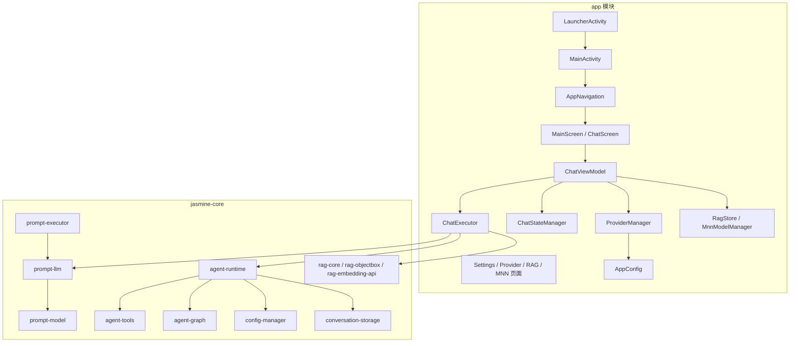

# 项目整体架构分析

## 文档说明

- 本文档结论**完全基于代码**。
- 依据来源包括：`settings.gradle.kts`、`app/build.gradle.kts`、`AndroidManifest.xml`、`app` 源码、`jasmine-core` 模块源码。
- **不依据仓库中的说明文档**做架构定性。

## 最终架构定性

该项目整体并不是单一架构，而是一个**有主线、有次级实现、有迁移痕迹的混合架构系统**。

最准确的总定义：

> **模块化分层单体（Modular Layered Monolith）**
>
> 应用层：**Single-Activity Compose 主壳 + 聊天主链 MVVM/UDF + 设置页 Stateful Compose + Service Locator/Facade**
>
> 核心层：**分层核心库 + 局部 Ports & Adapters + Strategy/Builder/Registry 插件化**

## 整体分层关系图

## 一、整个仓库是什么架构

### 1. 是模块化分层单体

原因：

1. 所有模块都在同一仓库、同一 Gradle 工程中。
2. 最终围绕一个 Android App 构建，不是独立部署单元。
3. `jasmine-core` 是内部核心能力库，不是外部独立服务。

因此它不是微服务、不是多端共享内核工程，而是：

> **模块化单体**

同时模块按能力域分层：

- `prompt`
- `agent`
- `config`
- `conversation`
- `rag`

所以更精确叫：

> **模块化分层单体**

## 二、应用层是什么架构

### 1. 主壳：Single-Activity + Navigation Compose

代码事实：

- `AndroidManifest.xml` 当前注册的 Activity 只有 `LauncherActivity`、`MainActivity`
- `MainActivity` 中直接挂 `AppNavigation`
- `AppNavigation.kt` 已覆盖主页面与大量设置子页面

因此主壳架构是：

> **Single-Activity + Navigation Compose**

### 2. 启动页：Activity Controller + Stateful Compose

`LauncherActivity` 自己负责：

- 权限检查
- 文档树选择
- 工作区解析
- Agent 模式开关
- 跳转 `MainActivity`

没有单独 ViewModel，所以它不是 MVVM，而是：

> **Activity Controller 风格 + Stateful Compose**

### 3. 聊天主链：MVVM + UDF + Coordinator

代码事实：

- `ChatViewModel` 负责状态与事件
- `ChatUiState` 统一状态
- `ChatUiEvent` 统一事件入口
- `ChatScreen` / `MainScreen` 通过 `collectAsState()` 渲染
- `ChatExecutor` 负责实际执行编排

因此聊天主链不是单纯 ViewModel 模式，而是：

> **MVVM + 单向数据流（UDF）+ Application Service / Coordinator**

其中：

- `ChatViewModel` = MVVM 的 VM
- `ChatUiState` / `ChatUiEvent` = UDF 状态与事件
- `ChatExecutor` = 协调器 / 应用服务
- `ChatStateManager` = State Holder / State Manager

### 4. 设置与配置页：Stateful Compose + 直接服务访问

设置相关页面普遍存在这些特征：

- Composable 内部 `remember { mutableStateOf(...) }`
- 直接读取 `ProviderManager`
- 直接读取 `AppConfig.configRepo()` / `AppConfig.providerRegistry()`
- 个别页面直接创建 `ConversationRepository`

因此这部分**不是严格 MVVM**，而是：

> **Stateful Compose 页面 + Facade/Repository 直连**

也可以理解为：

> **Smart View / View-centric Compose**

## 三、为什么不能把整个 app 说成纯 MVVM

### 能算 MVVM 的部分

- `ChatViewModel`
- `ChatUiState`
- `ChatScreen`
- `MainScreen`
- `MainActivity`

### 不能算严格 MVVM 的部分

- `LauncherActivity`
- `SettingsActivity`
- `ProviderConfigActivity`
- `ProviderListActivity`
- `TokenManagementActivity`
- `SamplingParamsConfigActivity`
- 多数设置子页

### 原因

1. 很多页面没有独立 ViewModel。
2. 页面直接碰 `ProviderManager` / `AppConfig` / `ConversationRepository`。
3. 缺少统一 UseCase 层。
4. `ChatViewModel` 本身还承担了超出 ViewModel 的编排职责。

所以正确结论是：

> **聊天主链是 MVVM，但整个 app 层不是纯 MVVM，而是混合展示架构。**

## 四、依赖管理是什么架构

### 1. Koin DI 存在，但只覆盖一部分

目前明显通过 Koin 注入的核心对象包括：

- `ConversationRepository`
- `ChatViewModel`

这说明有 DI，但并没有把全部基础设施都交给 DI 容器。

### 2. 主体仍然依赖 Service Locator + Facade

`AppConfig` 提供：

- `configRepo()`
- `providerRegistry()`
- `mcpConnectionManager()`
- `checkpointService()`

这是典型：

> **Service Locator**

`ProviderManager` 统一包装 provider/config 的访问与保存，这是：

> **Facade**

因此依赖管理要定性为：

> **Koin DI + Service Locator + Facade 混合**

## 五、配置系统是什么架构

配置系统可以拆成三层：

1. `EncryptedConfigRepository` / `SharedPreferencesConfigRepository`
   - **Repository**
2. `ProviderRegistry`
   - **Registry**
3. `ProviderManager`
   - **Facade**

因此配置系统整体属于：

> **Repository + Registry + Facade**

## 六、`jasmine-core` 是什么架构

### 1. 主体是分层核心库

按依赖与职责，大致分为：

- `prompt-model`：底层模型
- `prompt-llm`：LLM 抽象层
- `prompt-executor`：provider 客户端/执行层
- `agent-tools / graph / planner / runtime / observe`：Agent 能力层
- `config-manager / conversation-storage / rag-*`：支撑与基础设施层

所以其主体首先是：

> **分层核心库**

### 2. 内部有局部 Ports & Adapters

带明显“端口”特征的抽象：

- `ChatClient`
- `Tool`
- `SystemContextProvider`
- `PersistenceStorageProvider`

它们都允许不同实现注入进来，因此具有：

> **Ports & Adapters 倾向**

但它不是完整的 Hexagonal，因为：

- Android/文件/Room 实现并未被完全隔离到系统外围
- app 层仍知道很多具体实现
- 整体没有形成严格内外环边界

所以正确说法是：

> **局部端口/适配器，不是完整六边形架构**

### 3. 大量使用 Strategy / Builder / Registry / Plugin 模式

代表性结构：

- Strategy：`AgentStrategyType`、压缩策略、回滚策略、shell policy
- Builder：`AgentRuntimeBuilder`、`ToolRegistryBuilder`
- Registry：`ProviderRegistry`、`ToolRegistry`
- Plugin 扩展点：`SystemContextProvider`、`Tool`、Trace Writer、Persistence Provider

因此 `jasmine-core` 的最佳定性是：

> **分层核心库 + 局部端口适配 + Strategy/Builder/Registry/插件化扩展**

## 七、导航架构当前处于什么状态

这是当前代码里非常明显的一个事实：

1. Manifest 只注册 `LauncherActivity`、`MainActivity`
2. `AppNavigation` 已纳入大量设置页
3. 代码中仍残留对 `SettingsActivity`、`ProviderConfigActivity` 等旧 Activity 的跳转

因此导航架构不是完全纯净的单态，而是：

> **主线已迁移到 Single-Activity Navigation Compose，但代码仍保留旧 Multi-Activity 包装层，属于迁移中的混合导航架构。**

## 八、当前不应误判的两点

### 1. 不应误判为纯 MVVM 项目

因为只有聊天主链显著符合 MVVM；设置与配置页大多不是。

### 2. 不应误判为完整 Clean / Hexagonal 项目

因为：

- 缺少稳定的 UseCase 层
- 展示层经常直接访问 Facade/Repository
- `core` 并非完全平台无关纯内核

## 九、最终总括

如果只给一句最准确的总结：

> **这是一个以 Android Agent App 为目标的模块化分层单体工程；主运行链使用 Single-Activity Compose，聊天主链采用 MVVM + UDF + Coordinator，设置页采用 Stateful Compose 直接访问服务，配置层采用 Repository/Registry/Facade，核心库采用分层 + 局部端口适配 + Strategy/Builder/Registry 插件化。**

## 十、附：当前架构标签总表

| 层级 | 架构标签 |
|---|---|
| 仓库整体 | 模块化分层单体 |
| 主应用壳 | Single-Activity + Navigation Compose |
| 启动入口 | Activity Controller + Stateful Compose |
| 聊天主链 | MVVM + UDF + Coordinator |
| 聊天渲染状态 | State Holder / State Manager |
| 设置/配置页 | Stateful Compose + Service Access |
| 依赖管理 | Koin DI + Service Locator + Facade |
| 配置系统 | Repository + Registry + Facade |
| 核心层 | 分层核心库 + 局部 Ports & Adapters |
| 核心行为扩展 | Strategy + Builder + Registry + Plugin |
