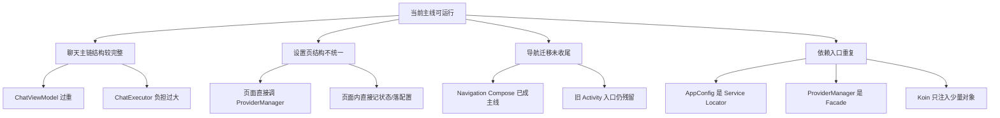
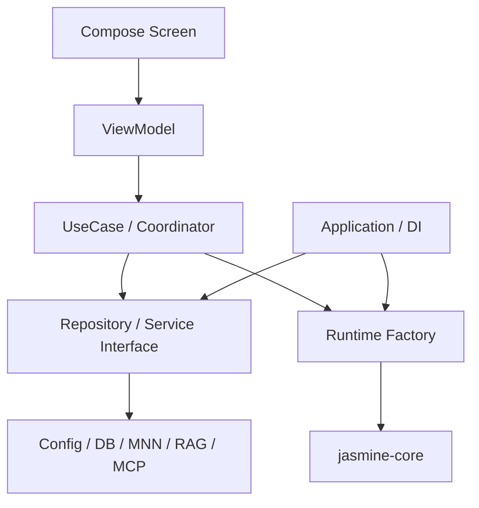

# 项目架构优化建议

## 文档说明

- 本文档基于当前代码结构给出**可落地的架构优化建议**。
- 目标不是推翻重来，而是在**不破坏现有功能**前提下逐步收口架构。
- 结论依据：`app`、`jasmine-core`、导航、配置、MNN、RAG、会话与 Agent 主链源码。

## 先说结论

这个项目**不需要重写**，但需要**收口**。

当前最需要优化的不是功能缺失，而是下面四个问题：

1. **展示层架构不统一**：聊天主链是 MVVM，设置页大多不是。
2. **`ChatViewModel` 过重**：承担了过多编排与基础设施组装职责。
3. **导航处于迁移中**：主线已是 Navigation Compose，但残留旧 Activity 跳转逻辑。
4. **全局依赖入口过多**：`Koin`、`AppConfig`、`ProviderManager` 同时存在，边界不够清晰。

因此最合理的优化方向不是“全面改成某一种纯架构”，而是：

> **保持模块化分层单体不变，把 app 层逐步收口为统一的 Compose + ViewModel + UseCase/Coordinator 架构，同时让 `jasmine-core` 继续承担可复用能力。**

## 当前架构问题总览

## 一、当前架构里做得对的部分

这些部分**不应该推倒重来**。

### 1. `jasmine-core` 的模块化方向是对的

优点：

- 按能力域拆成 `prompt / agent / config / conversation / rag`
- 能力边界整体可读
- 具备较好的复用潜力
- 运行时扩展点明确（Tool、ChatClient、SystemContextProvider、PersistenceStorageProvider）

建议：

> **保留 `jasmine-core` 作为核心能力层，不要把这些能力再回灌进 `app`。**

### 2. 聊天主链已经有统一状态与事件入口

优点：

- `ChatUiState`
- `ChatUiEvent`
- `ChatViewModel`
- `ChatScreen/MainScreen`

这一套已经接近稳定的 Compose 主链。

建议：

> **聊天主链继续保持 MVVM/UDF，不要回退成页面里直接写业务。**

### 3. 运行时能力分层已经形成

目前已经能看出：

- 展示层：Compose
- 编排层：ViewModel / Executor
- 能力层：`jasmine-core`
- 持久化与配置层：Repository / Config
- 原生层：MNN JNI

这说明项目已有良好的演进基础。

## 二、当前最明显的架构问题

## 1. `ChatViewModel` 过重

它目前同时承担：

- UI 状态管理
- 导航事件
- 会话订阅
- provider/model 切换
- tool registry 组装
- runtime 构建
- RAG/MCP/trace/snapshot/event 接线
- 执行入口调度
- 流式状态协调

这会带来三个问题：

1. **可测试性下降**
2. **修改风险扩大**
3. **职责边界不清**

### 优化建议

把 `ChatViewModel` 收缩成：

- 状态发布者
- UI 事件入口
- 少量页面级协调逻辑

把下面能力继续下沉：

- 对话管理 → `ConversationUseCase` / `ConversationCoordinator`
- 模型选择 → `ModelSelectorUseCase`
- Agent 执行组装 → `AgentExecutionCoordinator`
- 设置状态读取 → 独立设置用例/状态器

## 2. `ChatExecutor` 也偏重，和 ViewModel 形成“双重编排中心”

`ChatExecutor` 负责实际执行是合理的，问题在于它现在不只是执行，还承接了太多装配判断。

表现为：

- 普通聊天和 Agent 两条线都在这里汇聚
- graph / planner / trace / persistence / rag 都从这里接入
- 它已经接近“应用运行时总协调器”

### 优化建议

不要再让 `ChatExecutor` 继续膨胀，应该拆出：

- `ChatExecutionService`：普通聊天执行
- `AgentExecutionService`：Agent 执行
- `ExecutionRuntimeFactory`：构建 tracing/event/persistence/tool registry/system context

这样 `ChatExecutor` 最终可以退化成：

> 一个轻量门面，负责路由到不同执行服务。

## 3. 设置页大量不是 MVVM，而是页面直连服务

当前设置页普遍是：

- 页面内部 `remember { mutableStateOf(...) }`
- `DisposableEffect` 时保存配置
- 直接调 `ProviderManager`
- 直接调 `AppConfig.configRepo()`

这样的问题：

1. 状态逻辑分散在页面里
2. 页面难复用、难测试
3. 一旦配置项增多，页面会越来越厚
4. 很难统一做数据同步、校验和刷新

### 优化建议

设置页不要一下子全部重构，但至少按“设置域”逐步收口为 ViewModel：

- `SettingsViewModel`
- `ProviderListViewModel`
- `ProviderConfigViewModel`
- `SamplingParamsViewModel`
- `TokenManagementViewModel`
- `RagConfigViewModel`

注意不是为了“形式上有 ViewModel”，而是为了收回：

- 配置读取
- 输入校验
- 提交保存
- 刷新逻辑
- 异步加载

## 4. 导航迁移未收尾

当前已经明显是 `Navigation Compose` 主线，但还保留：

- `SettingsActivity`
- `ProviderConfigActivity`
- `ProviderListActivity`
- 以及部分 `startActivity(...)` 旧跳转

而 Manifest 里当前并未注册多数旧 Activity。

这意味着代码处于：

> **已经迁移了一半，但收尾不完整**

### 优化建议

导航层要明确目标：

> **主链统一走 `MainActivity + AppNavigation`，旧 Activity 仅保留确实需要独立系统入口的页面。**

建议步骤：

1. 把 `ChatScreen` 中旧 `Activity` 跳转切换为 nav route
2. 确认 `AppNavigation` 已覆盖的页面，不再保留等价旧 Activity 入口
3. 将未使用且未注册的旧 Activity 标记待删除
4. 最终只保留真正必须独立存在的 Activity

## 5. 依赖管理边界不清晰

当前同时存在：

- `Koin` 注入
- `AppConfig` 全局服务定位
- `ProviderManager` 门面

这不是完全错误，但边界需要统一。

### 当前问题

1. 有的对象走 DI
2. 有的对象走全局单例
3. 有的对象走门面
4. 页面层常常直接碰到全局入口

### 优化建议

建议统一成下面规则：

#### 规则 1：页面层只依赖 ViewModel

页面不要直接调：

- `ProviderManager`
- `AppConfig`
- `ConversationRepository`

#### 规则 2：ViewModel 只依赖 UseCase / Coordinator / Repository 接口

不要在 ViewModel 内部大面积直接 new 或手工拼运行时。

#### 规则 3：全局 Service Locator 只留给 Composition Root/基础设施初始化使用

也就是 `Application`、启动初始化、极少数基础设施桥接层可以碰 `AppConfig`。

#### 规则 4：`ProviderManager` 继续保留，但逐渐降级为兼容门面

不要再让新的业务逻辑继续堆在 `ProviderManager` 上。

## 三、最优先的重构顺序

这里最重要的是**顺序**。

如果顺序错了，重构会非常痛。

## 第一阶段：先收导航

目标：把“运行入口”统一。

建议动作：

1. 以 `AppNavigation` 为唯一主导航
2. 把 `ChatScreen` 的旧 `startActivity(...)` 改成 route 导航
3. 检查哪些旧 Activity 已经没有必要
4. 清理 Manifest 与代码不一致的历史残留

### 为什么先做这个

因为导航统一以后，后续 ViewModel/页面重构才不会一边改页面一边维护两套路由体系。

## 第二阶段：拆设置域 ViewModel

目标：让 app 展示层风格统一。

建议优先顺序：

1. `SettingsScreen`
2. `ProviderListScreen`
3. `ProviderConfigScreen`
4. `SamplingParamsConfigScreen`
5. `TokenManagementScreen`
6. `RagConfigScreen`

### 为什么先做设置页

因为设置页目前是最明显的“非统一架构区”，而且改它们通常不会破坏聊天主链。

## 第三阶段：拆 `ChatViewModel`

目标：减少主链耦合度。

建议拆分方向：

- `ConversationCoordinator`
- `ModelSelectionCoordinator`
- `ExecutionCoordinator`
- `AgentRuntimeFactory`
- `ChatUiStateReducer`（如果后面想进一步收口状态更新）

### 为什么不先拆聊天主链

因为聊天主链是当前最核心、最敏感、最复杂的可运行路径，应该在外围收口后再动它。

## 第四阶段：统一依赖注入边界

目标：弱化 `AppConfig`/`ProviderManager` 在页面层的直接曝光。

建议做法：

1. 把关键服务纳入 Koin
2. ViewModel 只通过注入拿依赖
3. `AppConfig` 仅保留基础设施初始化职责
4. `ProviderManager` 缩成兼容适配门面

## 第五阶段：继续下沉核心运行时装配

目标：把 app 里仍然偏“框架化”的编排逻辑收口。

适合继续下沉到 `jasmine-core` 或独立 app service 的内容：

- Agent runtime 组装
- tracing / event / persistence 初始化
- tool registry 构建策略
- planner/graph/simple loop 的执行选择

## 四、建议的目标架构

### 目标状态下的分工

#### Compose Screen
- 只关心显示和交互
- 不直接访问配置服务/仓库

#### ViewModel
- 只负责 UI 状态与事件转换
- 不承担大规模基础设施拼装

#### UseCase / Coordinator
- 负责业务流程
- 负责装配执行参数
- 负责调用 runtime/service

#### Repository / Service
- 负责持久化、配置、MNN、RAG、MCP 访问

#### `jasmine-core`
- 保持通用能力层
- 少放 app 专属状态管理逻辑

## 五、哪些地方建议不要动

为了避免过度重构，下面这些地方建议谨慎：

### 1. 不要推翻 `jasmine-core` 的模块边界

当前模块切法总体是合理的。

### 2. 不要把所有逻辑都塞回 ViewModel

收口不是把 `ChatExecutor` 逻辑全部塞回 `ChatViewModel`，那样会更糟。

### 3. 不要为了“纯架构”把本地 MNN 能力硬搬进 core

本地模型、JNI、Android 文件与模型管理明显偏 app 基础设施，当前留在 `app` 是合理的。

### 4. 不要一次性全量重构所有页面

应该按域分批推进，否则风险过高。

## 六、推荐的文档化和治理动作

除代码重构外，还建议补两类治理动作：

### 1. 为每个设置域定义边界

例如：

- Provider 设置域
- Sampling 设置域
- Token 设置域
- RAG 设置域
- Agent 工具设置域

每个域约定：

- Screen
- ViewModel
- UiState
- UiEvent
- UseCase（必要时）

### 2. 为应用层建立依赖规则

建议形成明确约束：

1. `Screen` 不得直接访问 `ProviderManager`
2. `Screen` 不得直接访问 `ConversationRepository`
3. `ViewModel` 不直接依赖 `AppConfig`
4. 运行时装配优先走 `Factory/Coordinator`

## 七、建议的执行路线图

### 短期（低风险）

- 清理导航残留
- 新增设置域 ViewModel
- 减少页面直连 `ProviderManager`

### 中期（中风险）

- 拆 `ChatViewModel`
- 抽出 `ExecutionCoordinator` / `RuntimeFactory`
- 统一 Koin 注入边界

### 长期（更系统）

- 明确 app 层 domain/usecase 边界
- 继续提升 `jasmine-core` 与 app 编排边界清晰度
- 把部分通用运行时装配继续下沉

## 八、最终建议

如果只保留最重要的一句话建议，那就是：

> **不要推倒重来；优先统一导航和设置页架构，再逐步拆轻 `ChatViewModel` 与 `ChatExecutor`，最后再统一依赖注入边界。**

这条路径最稳，也最符合当前代码现状。
