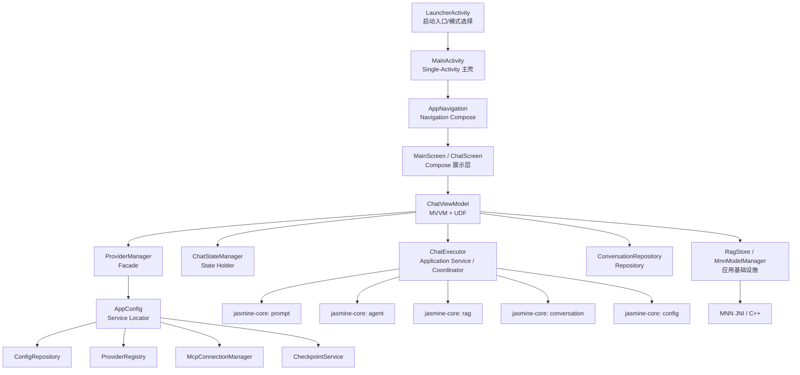

# 项目架构分层图与文件归类清单

## 文档说明

- 本文档**只基于源码、Gradle、Manifest、导航与核心模块代码**分析。
- **不以仓库说明文档为判断依据**。
- 结论时间：2026-03-11。

## 一句话结论

该项目整体属于**模块化分层单体（Modular Layered Monolith）**；`app` 层是 **Single-Activity Compose 主壳 + 聊天主链 MVVM/UDF + 设置页 Stateful Compose** 的混合架构；`jasmine-core` 是**分层核心库 + 局部端口/适配器 + Strategy/Builder/Registry 插件化**架构。

## 项目架构分层图

## 展示层架构归类

| 范围 | 架构归类 | 结论 |
|---|---|---|
| 启动页 | Activity Controller + Stateful Compose | `LauncherActivity` 自己处理权限、工作区选择、模式切换 |
| 主应用壳 | Single-Activity + Navigation Compose | `MainActivity` + `AppNavigation` |
| 聊天主链 | MVVM + UDF + Coordinator | `ChatViewModel` + `ChatUiState` + `ChatUiEvent` + `ChatExecutor` |
| 聊天流式渲染 | State Holder / State Manager | `ChatStateManager` |
| 设置/配置页 | Stateful Compose + 直接服务访问 | 页面直接使用 `ProviderManager` / `AppConfig` / `ConversationRepository` |
| 导航状态 | 迁移中的混合导航架构 | 主线已是 Navigation Compose，但仍残留旧 Activity 跳转代码 |

## 核心层架构归类

| 范围 | 架构归类 | 结论 |
|---|---|---|
| `jasmine-core` 整体 | 分层核心库 | `prompt / agent / config / conversation / rag` 分模块 |
| LLM 抽象 | Ports & Adapters 倾向 | `ChatClient` 是端口，不同 provider 是适配实现 |
| 工具系统 | Registry + Plugin + Strategy | `Tool`、`ToolRegistry`、策略切换 |
| Agent 运行时 | Builder + Strategy | `AgentRuntimeBuilder`、`ToolRegistryBuilder`、Graph/Loop 切换 |
| 配置系统 | Repository + Registry + Facade | `ConfigRepository` + `ProviderRegistry` + `ProviderManager` |
| 会话存储 | Repository | `ConversationRepository` |
| RAG | Provider 插件式接入 | `SystemContextProvider` + `RagContextProvider` |

## 文件归类清单

### 1. 应用入口与导航

| 文件 | 层/角色 | 架构归类 | 说明 |
|---|---|---|---|
| `app/src/main/AndroidManifest.xml` | 应用声明 | 启动配置 | 当前只注册 `LauncherActivity`、`MainActivity` |
| `app/src/main/java/com/lhzkml/jasmine/JasmineApplication.kt` | 应用初始化 | Composition Root | 初始化 `AppConfig`、`ProviderManager`、`RagStore`、Koin |
| `app/src/main/java/com/lhzkml/jasmine/LauncherActivity.kt` | 启动入口 | Activity Controller + Stateful Compose | 选择普通聊天/工作区 Agent 模式 |
| `app/src/main/java/com/lhzkml/jasmine/MainActivity.kt` | 主壳入口 | Single-Activity Host | 挂载 Compose 与 `AppNavigation` |
| `app/src/main/java/com/lhzkml/jasmine/ui/navigation/AppNavigation.kt` | 导航层 | Navigation Compose | 当前主导航中枢 |
| `app/src/main/java/com/lhzkml/jasmine/ui/navigation/Routes.kt` | 路由定义 | 路由常量表 | 全应用路由常量 |

### 2. 聊天主链

| 文件 | 层/角色 | 架构归类 | 说明 |
|---|---|---|---|
| `app/src/main/java/com/lhzkml/jasmine/ui/ChatViewModel.kt` | 展示逻辑核心 | MVVM ViewModel + Coordinator | 统一状态、事件分发、运行时编排 |
| `app/src/main/java/com/lhzkml/jasmine/ui/ChatUiState.kt` | 展示状态模型 | UDF State | 聊天统一 UI 状态与导航事件 |
| `app/src/main/java/com/lhzkml/jasmine/ui/MainScreen.kt` | 主页面壳 | Compose View | 抽屉、会话、文件树外层 UI |
| `app/src/main/java/com/lhzkml/jasmine/ui/ChatScreen.kt` | 聊天页面 | Compose View | 订阅状态、转发事件、渲染消息 |
| `app/src/main/java/com/lhzkml/jasmine/ChatExecutor.kt` | 应用服务 | Application Service / Coordinator | 聊天/Agent 执行分流 |
| `app/src/main/java/com/lhzkml/jasmine/ChatStateManager.kt` | UI 状态协调 | State Holder / State Manager | 流式消息拼装与 UI 列表更新 |
| `app/src/main/java/com/lhzkml/jasmine/ui/ChatMessageList.kt` | UI 组件 | Compose View | 消息列表渲染 |
| `app/src/main/java/com/lhzkml/jasmine/ui/ChatInputBar.kt` | UI 组件 | Compose View | 输入栏与模型选择 |
| `app/src/main/java/com/lhzkml/jasmine/ui/DrawerContent.kt` | UI 组件 | Compose View | 会话抽屉内容 |
| `app/src/main/java/com/lhzkml/jasmine/ui/FileTreeComposable.kt` | UI 组件 | Compose View | 工作区文件树 |

### 3. 设置与配置页面

| 文件 | 层/角色 | 架构归类 | 说明 |
|---|---|---|---|
| `app/src/main/java/com/lhzkml/jasmine/SettingsActivity.kt` | 设置入口 | Stateful Compose + Service Access | 页面自己管理状态，不走独立 ViewModel |
| `app/src/main/java/com/lhzkml/jasmine/ProviderListActivity.kt` | 供应商列表 | Stateful Compose + Facade Access | 直接访问 `ProviderManager` / `AppConfig` |
| `app/src/main/java/com/lhzkml/jasmine/ProviderConfigActivity.kt` | 供应商配置 | Stateful Compose + Repository/Registry Access | 页面内直接读写配置 |
| `app/src/main/java/com/lhzkml/jasmine/TokenManagementActivity.kt` | Token 配置 | Stateful Compose + Repository Access | 直接创建 `ConversationRepository` |
| `app/src/main/java/com/lhzkml/jasmine/SamplingParamsConfigActivity.kt` | 采样参数 | Stateful Compose + Facade Access | 页面内直接保存参数 |
| `app/src/main/java/com/lhzkml/jasmine/SystemPromptConfigActivity.kt` | 系统提示词配置 | Stateful Compose | 页面自管理状态 |
| `app/src/main/java/com/lhzkml/jasmine/ToolConfigActivity.kt` | 工具配置 | Stateful Compose | 配置型页面 |
| `app/src/main/java/com/lhzkml/jasmine/AgentStrategyActivity.kt` | Agent 策略页 | Stateful Compose | 策略开关页 |
| `app/src/main/java/com/lhzkml/jasmine/TraceConfigActivity.kt` | Trace 配置页 | Stateful Compose | 调试配置页 |
| `app/src/main/java/com/lhzkml/jasmine/PlannerConfigActivity.kt` | Planner 配置页 | Stateful Compose | 规划器配置 |

### 4. 应用层基础设施

| 文件 | 层/角色 | 架构归类 | 说明 |
|---|---|---|---|
| `app/src/main/java/com/lhzkml/jasmine/config/AppConfig.kt` | 全局服务入口 | Service Locator | 暴露配置、注册表、MCP、快照服务 |
| `app/src/main/java/com/lhzkml/jasmine/config/ProviderManager.kt` | 配置门面 | Facade | 统一包装 provider/config 操作 |
| `app/src/main/java/com/lhzkml/jasmine/config/EncryptedConfigRepository.kt` | 配置存储 | Repository | 加密偏好存储 |
| `app/src/main/java/com/lhzkml/jasmine/config/SharedPreferencesConfigRepository.kt` | 配置存储 | Repository | 降级存储实现 |
| `app/src/main/java/com/lhzkml/jasmine/di/AppModule.kt` | DI 配置 | Dependency Injection | 注入 `ConversationRepository` |
| `app/src/main/java/com/lhzkml/jasmine/di/ViewModelModule.kt` | DI 配置 | Dependency Injection | 注入 `ChatViewModel` |
| `app/src/main/java/com/lhzkml/jasmine/RagStore.kt` | RAG 初始化入口 | Application Infrastructure | ObjectBox / Embedding 组装 |

### 5. 已出现但未统一接入的 ViewModel

| 文件 | 架构归类 | 当前状态 |
|---|---|---|
| `app/src/main/java/com/lhzkml/jasmine/ui/viewmodel/ConversationViewModel.kt` | MVVM ViewModel | 职责清晰，但未成为主聊天链实际入口 |
| `app/src/main/java/com/lhzkml/jasmine/ui/viewmodel/ModelViewModel.kt` | MVVM ViewModel | 模型选择逻辑已拆分，但未形成全应用统一使用 |

### 6. 本地模型与原生能力

| 文件 | 层/角色 | 架构归类 | 说明 |
|---|---|---|---|
| `app/src/main/java/com/lhzkml/jasmine/mnn/MnnChatClient.kt` | 本地 LLM 适配器 | Adapter | 将本地模型适配为 `ChatClient` |
| `app/src/main/java/com/lhzkml/jasmine/mnn/MnnModelManager.kt` | 本地模型服务 | Manager / Service | 模型下载、导入、导出、配置 |
| `app/src/main/cpp/mnn_jni.cpp` | 原生桥接 | JNI Adapter | Kotlin ↔ C++/MNN 桥接 |
| `app/src/main/cpp/CMakeLists.txt` | 原生构建 | Native Build Config | 本地推理构建配置 |

### 7. `jasmine-core` 核心模块

| 目录/文件 | 架构归类 | 说明 |
|---|---|---|
| `jasmine-core/prompt/prompt-model` | 领域模型层 | Prompt/消息/工具调用等模型 |
| `jasmine-core/prompt/prompt-llm/src/main/java/.../ChatClient.kt` | Port | LLM 客户端抽象 |
| `jasmine-core/prompt/prompt-llm/src/main/java/.../LLMSession.kt` | 会话抽象 | 可写会话、上下文累积 |
| `jasmine-core/prompt/prompt-llm/src/main/java/.../SystemContextProvider.kt` | Port + Provider 插件点 | 系统上下文注入机制 |
| `jasmine-core/prompt/prompt-executor/src/main/java/.../ChatClientFactory.kt` | Factory | 远程 provider client 创建 |
| `jasmine-core/config/config-manager/src/main/java/.../ProviderRegistry.kt` | Registry | Provider 元数据与活动配置解析 |
| `jasmine-core/conversation/conversation-storage/src/main/java/.../ConversationRepository.kt` | Repository | 会话与消息持久化 |
| `jasmine-core/agent/agent-tools/src/main/java/.../Tool.kt` | Tool 抽象 | 工具端口 |
| `jasmine-core/agent/agent-tools/src/main/java/.../ToolExecutor.kt` | Tool Calling Loop | 简单循环 Agent |
| `jasmine-core/agent/agent-graph/src/main/java/.../GraphAgent.kt` | Graph Runtime | 图策略 Agent |
| `jasmine-core/agent/agent-graph/src/main/java/.../PredefinedStrategies.kt` | Strategy | 预定义图执行策略 |
| `jasmine-core/agent/agent-runtime/src/main/java/.../ToolRegistryBuilder.kt` | Builder | 工具注册表组装 |
| `jasmine-core/agent/agent-runtime/src/main/java/.../AgentRuntimeBuilder.kt` | Builder | trace / event / snapshot / context 组装 |
| `jasmine-core/agent/agent-observe/src/main/java/.../snapshot/PersistenceStorageProvider.kt` | Port + Adapter | 持久化存储抽象与文件/内存实现 |
| `jasmine-core/rag/rag-core/src/main/java/.../RagContextProvider.kt` | Provider Adapter | 将 RAG 结果接入 system context |
| `jasmine-core/rag/rag-objectbox` | 基础设施实现 | ObjectBox 向量索引 |
| `jasmine-core/rag/rag-embedding-api` | 外部适配器 | 远程 embedding API 实现 |

## 当前明确不属于主运行链的部分

| 位置 | 结论 |
|---|---|
| `jasmine-core/termux` | 目录存在，但当前未被 `settings.gradle.kts` 纳入主构建图 |
| `jasmine-core:agent:agent-a2a` | 已 include，但当前未看到 app 主运行链实际接线 |

## 结论摘要

1. **不是纯 MVVM 项目**，而是**聊天主链 MVVM/UDF + 其他页面 Stateful Compose**。
2. **不是纯 Clean Architecture**，因为展示层经常直达 Facade/Repository，且缺少统一 UseCase 层。
3. **不是纯 Hexagonal**，但 `ChatClient`、`Tool`、`SystemContextProvider`、`PersistenceStorageProvider` 等具有明显端口/适配器特征。
4. 当前工程最准确的归类是：

> **模块化分层单体 + Single-Activity Compose 主壳 + 聊天主链 MVVM/UDF/Coordinator + 设置页 Stateful Compose + 核心层分层/端口适配/插件化**
